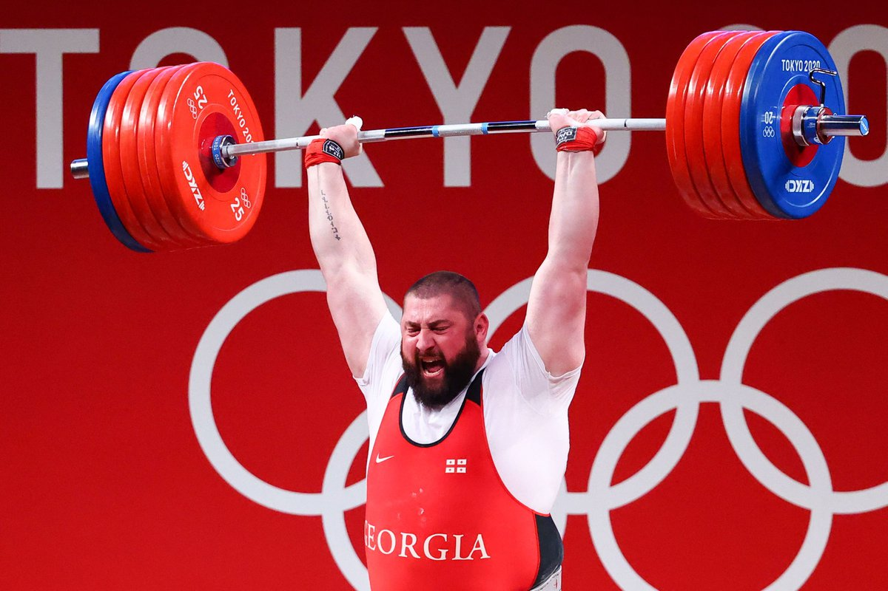

# How good is Lasha?


*Lasha Lifting Image source from [Infobae](https://www.infobae.com/aroundtherings/olympics-games/tokyo-2020/2021/08/04/lasha-talakhadze-smashes-world-and-olympic-records-for-weightlifting-gold/)*

## About

Lasha Talakhadze recent performance in the Tokyo 2020 Olympics was an mind blowing display of strength.

Here lies the inspiration for this project. How good is Lasha? Is there a way to display this graphically?

## Jupyter Notebook

The code is split into two forms, the notebook and a .py file.

The notebook contains code used to wrangle the data and then output this into `results_all.pkl` file.

The notebook contains a lot of explanations as to why I did things a certain way.

Unfortunately, the jupyter notebook uses my conda environment which has a jumble of libraries. The main dependencies on top of conda are:
- tabula
- altair 

## main.py file

This takes the `results_all.pkl` file and displays it in an interactive graph hosted using `streamlit`. The `Pipfile` should contain the dependences to run the streamlit application.

```bash
make run # requires make, docker etc
```

## How this is hosted

[The project is live on here](https://lasha.app.shivan.xyz).

